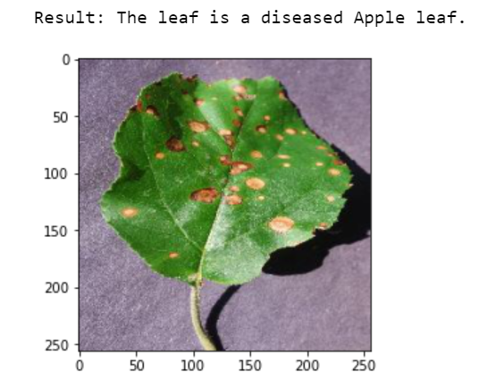

# Preserving Agriculture with Artificial Intelligence: A Step Towards Sustainable Farming
Diseased Apple Leaf        |  Diseased Tomato Leaf    | Healthy Tomato Leaf     | Healthy Apple Leaf
:-------------------------:|:-------------------------:|:-------------------------:|:-------------------------:
  |    |    |  

## Introduction
The term Artificial Intelligence can be described as the ability of machines to imitate cognitive functions including perception, learning, decision making, memory and language abilities, that are associated with human intelligence. 
AI is steadily emerging and making a significant impact in various sectors such as education, healthcare, transportation, finance, manufacturing, agriculture and many more.
Agriculture Industry - the mainstay profession in numerous countries worldwide is also turning towards artificially intelligent technologies to enhance crop yield productivity while utilizing resources more sustainably, control pest infestations, monitoring soil and crop health, precision farming and predictive analytics. 

## Applications of Artificial Intelligence in Agriculture

### 1. Precision Farming with Predictive Analytics
Precision farming uses Artificial Intelligence based systems to make crop yield and price predictions, weather forecasts, disease detection in plants, etc. These systems help farmers in proper and regulated farming by providing them correct guidance about optimum planting, water management, timely harvesting, crop rotation, type of crop to be grown, nutrition management, pest attacks. Understanding and forecasting pricing strategies for a particular crop based on the quality level and yield rate help farmers better negotiate for the best possible crop price.

### 2. Controlling Pest Infestations
Smart pest monitoring systems are being used for pest tracking, pesticide route planning and to detect the type of insect. If the detected insect is beneficial or neutral, the system does nothing. However, if it is harmful the system sends information to the cloud.

### 3. Soil and Crop Health Monitoring System
Type and nutrition level of soil plays a vital role in the crop quality. So, in order to monitor crop health on real time basis agriculture firms are using sensor data and satellite imagery to analyze current health of the farm.

### 4. Risk Management
Animal or human breaches can be recognized in real-time video feeds using machine learning-based surveillance systems that monitors the crop fields and sends immediate alert for suspicious activity, hence preventing the crops from deliberate destruction.

### 5. Agricultural Robotics and Digital Workforce
With the increase in global population size, the demand for food production is growing but at the same time the world is facing farm labor shortage. Introduction of digital workforce - smart tractors, agribots and robotics is transforming agriculture industry by overcoming the farm labor scarcity.

## Future of Artificial Intelligence in Agriculture
Artificial Intelligence in agriculture is not only improving farming practices but also solving the resource and labor scarcity to a great extent. As most Artificially Intelligent systems are currently only being used on well-connected and large farms, there is major need to focus on universal access. Connecting small farms in remote areas across the world will cement the future of automation and artificial intelligence in farming. 

The dataset is based on PlantVillage Dataset and can be downloaded from the given link: https://drive.google.com/drive/folders/1uj80JDgseEV4nECAycEewlHpFdPTgXN2
